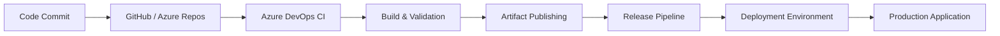

# 🚀 CI/CD Deployment Automation Pipeline for Todo Application

<p align="center">
  
</p>

<p align="center">
  
  
  
  
</p>

---

## 📌 Project Overview

This repository demonstrates the implementation of a complete **CI/CD (Continuous Integration & Continuous Deployment) Pipeline** using **Azure DevOps** for a multi-service Todo Application.

The primary objective of this project is to automate the software delivery lifecycle—from source code integration to production deployment—while maintaining a clean separation between application development and deployment automation.

---

## 🎯 Responsibilities of This Repository

This repository acts as an independent deployment automation layer responsible for:

* Continuous Integration (CI)
* Continuous Deployment (CD)
* Build Validation
* Artifact Management
* Environment Configuration
* Release Automation

The pipeline automatically detects changes, builds application artifacts, validates deployments, and delivers updates to the target environment without manual intervention.

---

## 📦 Application Source Repositories

### 🎨 Frontend Application

**Repository:** https://github.com/devopsinsiders/ReactTodoUIMonolith

**Technology Stack**

* ReactJS
* JavaScript
* Nginx Deployment

---

### ⚙️ Backend Application

**Repository:** https://github.com/devopsinsiders/PyTodoBackendMonolith

**Technology Stack**

* Python
* REST API
* Linux Runtime Environment

---

## 🏗️ CI/CD Architecture

```text
Developer Commit
        │
        ▼
Source Repository
        │
        ▼
Azure DevOps Pipeline
        │
 ┌──────┴──────┐
 │             │
 ▼             ▼
Build      Validation
 │             │
 └──────┬──────┘
        ▼
Artifact Creation
        │
        ▼
Release Pipeline
        │
        ▼
Target Environment
        │
        ▼
Application Deployment
```

---

# 🔄 CI/CD Pipeline Workflow

## Phase 1 — Continuous Integration (CI)

The CI pipeline is responsible for validating every code change before it reaches the deployment stage.

### Workflow

#### 1️⃣ Source Code Trigger

The pipeline automatically starts whenever:

* A commit is pushed
* A Pull Request is merged
* Changes are detected in the configured branch

---

#### 2️⃣ Build Stage

Azure DevOps provisions a fresh build agent and:

* Downloads source code
* Loads environment variables
* Prepares build runtime
* Executes application build process

---

#### 3️⃣ Validation Stage

The pipeline performs validation checks such as:

* Dependency verification
* Build verification
* Configuration validation
* Runtime checks

---

#### 4️⃣ Artifact Publishing

After successful validation:

* Build artifacts are generated
* Artifacts are published
* Release-ready packages are stored for deployment

---

# 🚀 Phase 2 — Continuous Deployment (CD)

The deployment pipeline automates the release process and updates the target environment.

### Workflow

#### 1️⃣ Artifact Retrieval

The deployment stage retrieves the latest validated build artifacts.

---

#### 2️⃣ Environment Configuration

Azure DevOps securely injects:

* Environment variables
* Secret values
* Runtime configurations

---

#### 3️⃣ Release Execution

The deployment workflow:

* Connects to the target environment
* Replaces previous application versions
* Deploys the latest release package

---

#### 4️⃣ Deployment Verification

Post-deployment checks ensure:

* Services are available
* Endpoints are reachable
* Deployment completed successfully

---

## 📊 End-to-End Delivery Flow



---

## 🔐 Pipeline Variables & Secrets

| Variable        | Description                               |
| --------------- | ----------------------------------------- |
| BACKEND_API_URL | Backend API endpoint consumed by frontend |
| DEPLOYMENT_HOST | Target deployment server                  |
| DEPLOYMENT_USER | Deployment user account                   |
| SSH_PRIVATE_KEY | Secure deployment authentication          |
| ENVIRONMENT     | Deployment environment identifier         |

---

## 🖥️ Frontend Interface

<p align="center">
  
</p>

---

## ✨ Key Features

* Azure DevOps CI/CD Implementation
* Automated Build Execution
* Automated Deployment Workflow
* Environment Configuration Management
* Secure Secret Handling
* Artifact-Based Release Process
* Scalable Deployment Architecture
* Separation of Application Code and Deployment Automation

---

## 🐳 Note on Containerization

This repository also contains Dockerfiles used for creating application runtime environments.

However, the primary focus of this project is the implementation of the **CI/CD pipeline and deployment automation process**. Containerization is included only as a supporting deployment component and is not the central objective of this repository.

---

## 📄 Disclaimer

The application source code belongs to its respective owners:

### Frontend

https://github.com/devopsinsiders/ReactTodoUIMonolith

### Backend

https://github.com/devopsinsiders/PyTodoBackendMonolith

This repository is intended solely to demonstrate CI/CD implementation, deployment automation, and DevOps workflow orchestration using Azure DevOps.

---

## 👩‍💻 Author

**Priya Jaiswal**

Azure Cloud | DevOps | Terraform | Azure DevOps

<p align="center">
  <a href="https://github.com/Pjaisw1103">
    
  </a>

  <a href="https://linkedin.com/in/priya-jaiswal1103">
    
  </a>
</p>

---

<p align="center">
⭐ If you found this project useful, consider giving it a star.
</p>
