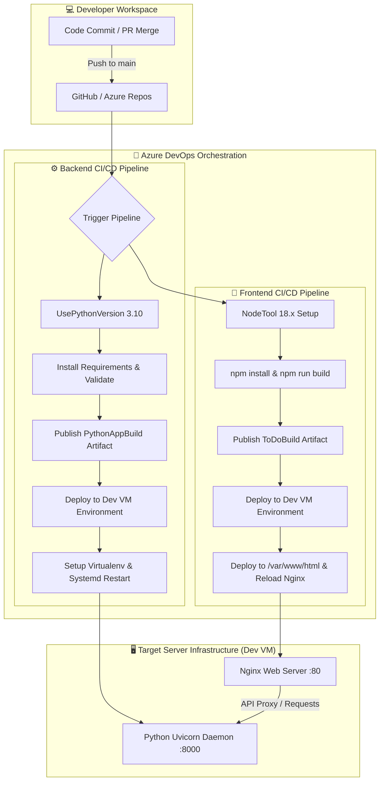

<p align="center">
  
</p>

<p align="center">
  
  
  
  
  
  
  
</p>

---

## 📌 Table of Contents

- [Overview](#-overview)
- [Architecture & Workflow](#-architecture--workflow)
- [Repository Structure](#-repository-structure)
- [Application Source Components](#-application-source-components)
- [CI/CD Pipelines Documentation](#-cicd-pipelines-documentation)
  - [Backend Pipeline (`dev-todoapp-pipeline.yml`)](#1-backend-pipeline-dev-todoapp-pipelineyml)
  - [Frontend Pipeline (`dev-todoui-pipeline.yml`)](#2-frontend-pipeline-dev-todoui-pipelineyml)
- [Docker Containerization](#-docker-containerization)
  - [Backend Dockerfile](#backend-dockerfile)
  - [Frontend Dockerfile](#frontend-dockerfile)
  - [Local Docker Execution Guide](#local-docker-execution-guide)
- [Azure DevOps Setup Guide](#-azure-devops-setup-guide)
- [Pipeline Variables & Secrets](#-pipeline-variables--secrets)
- [Frontend Interface](#-frontend-interface)
- [Troubleshooting & Best Practices](#-troubleshooting--best-practices)
- [Author & Credits](#-author--credits)

---

## 📌 Overview

This repository houses the complete **CI/CD (Continuous Integration & Continuous Deployment) Automation Pipeline** and full-stack source code for a multi-service **Todo Application**. Built using **Azure DevOps**, **Docker**, **Python FastAPI**, and **ReactJS**, this project demonstrates industry-standard practices for monorepo pipeline automation, artifact lifecycle management, containerization, and virtual machine deployment.

### 🌟 Key Technical Highlights
- **Full-Stack Monorepo Architecture:** Integrates Python FastAPI backend and ReactJS frontend applications alongside CI/CD automation pipelines and Docker configurations.
- **Automated CI/CD Workflows:** Automated triggers for commit integration, artifact building, stage dependencies, and zero-downtime release strategies.
- **Production-Grade Dockerization:** Includes multi-stage optimized builds, modern GPG keyring management, Microsoft SQL ODBC drivers, and container healthchecks.
- **Multi-Environment Deployment Target:** Pre-configured for deployment to Azure DevOps Virtual Machine Environment resources (`dev-env`).

---

## 🏗️ Architecture & Workflow

The pipeline orchestrates code flow from initial developer push down to production virtual machine servers and Nginx hosting layers.

### 📊 End-to-End Delivery Flow Diagram


```mermaid
flowchart TB
    subgraph Development ["💻 Developer Workspace"]
        A[Code Commit / PR Merge] -->|Push to main| B[GitHub / Azure Repos]
    end

    subgraph AzureDevOps ["🚀 Azure DevOps Orchestration"]
        B --> C{Trigger Pipeline}
        
        subgraph BackendCI ["⚙️ Backend CI/CD Pipeline"]
            C --> D1[UsePythonVersion 3.10]
            D1 --> D2[Install Requirements & Validate]
            D2 --> D3[Publish PythonAppBuild Artifact]
            D3 --> D4[Deploy to Dev VM Environment]
            D4 --> D5[Setup Virtualenv & Systemd Restart]
        end

        subgraph FrontendCI ["🎨 Frontend CI/CD Pipeline"]
            C --> E1[NodeTool 18.x Setup]
            E1 --> E2[npm install & npm run build]
            E2 --> E3[Publish ToDoBuild Artifact]
            E3 --> E4[Deploy to Dev VM Environment]
            E4 --> E5[Deploy to /var/www/html & Reload Nginx]
        end
    end

    subgraph Infrastructure ["🖥️ Target Server Infrastructure (Dev VM)"]
        D5 --> F1[Python Uvicorn Daemon :8000]
        E5 --> F2[Nginx Web Server :80]
        F2 -->|API Proxy / Requests| F1
    end
```

---

## 📁 Repository Structure

```text
CICD-Deployment-Automation-Pipeline/
├── ApplicationPipeline/
│   ├── dev-todoapp-pipeline.yml   # Azure DevOps YAML Pipeline for Python Backend CI/CD
│   └── dev-todoui-pipeline.yml    # Azure DevOps YAML Pipeline for React Frontend CI/CD
├── Docker/
│   ├── ToDoBackend/
│   │   └── Dockerfile             # Multi-layer Dockerfile (Python 3.10 + MS ODBC 17 + Healthcheck)
│   └── ToDoFrontend/
│       └── Dockerfile             # Multi-stage Dockerfile (Node 18 Builder -> Nginx Alpine Runtime)
├── PyTodoBackendMonolith/         # 🐍 Python FastAPI Backend Monolith Application Source Code
│   ├── app.py                     # REST API Server Logic
│   ├── requirements.txt           # Python Dependencies
│   ├── Dockerfile                 # Backend Standalone Dockerfile
│   └── azure-pipelines.yml        # Auto-Discovery Azure DevOps Pipeline
├── ReactTodoUIMonolith/           # ⚛️ ReactJS Frontend UI Monolith Application Source Code
│   ├── src/                       # React Components & UI Logic
│   ├── public/                    # Static Web Assets & Logos
│   ├── package.json               # Node.js Dependencies & Build Scripts
│   ├── Dockerfile                 # Frontend Standalone Dockerfile
│   └── azure-pipelines.yml        # Auto-Discovery Azure DevOps Pipeline
├── Screenshot 2026-06-12 125801.png # Application UI Preview Screenshot
└── README.md                      # Pipeline & Project Documentation
```

---

## 📦 Application Source Components

The full application source code is maintained directly within this repository:

| Component | Path / Directory | Tech Stack | Runtime / Server |
| :--- | :--- | :--- | :--- |
| **Frontend UI** | [`ReactTodoUIMonolith/`](./ReactTodoUIMonolith) | ReactJS 18, JavaScript, HTML5, CSS3 | Nginx Web Server |
| **Backend API** | [`PyTodoBackendMonolith/`](./PyTodoBackendMonolith) | Python 3.10, FastAPI, REST API | Uvicorn / Systemd Daemon |

---

## 🔄 CI/CD Pipelines Documentation

This section describes the execution workflow, triggers, and stage responsibilities for both application pipelines.

### 1️⃣ Backend CI/CD Workflow ([`dev-todoapp-pipeline.yml`](./ApplicationPipeline/dev-todoapp-pipeline.yml))

The backend pipeline automates the build, packaging, and deployment lifecycle of the Python FastAPI service.

- **Trigger Strategy:**
  - Triggers automatically upon commits pushed to the `main` branch.
- **Continuous Integration (CI) Stage:**
  - **Runtime Provisioning:** Sets up Python runtime (`3.9`) environment.
  - **Package Upgrade:** Upgrades `pip` package manager and validates dependencies.
  - **Artifact Publishing:** Packages backend application sources from `$(Build.SourcesDirectory)/app` and publishes pipeline artifact `PythonAppBuild`.
- **Continuous Deployment (CD) Stage:**
  - **Target Environment:** Connects to Virtual Machine resources registered under environment `dev-env`.
  - **Artifact Download:** Downloads `PythonAppBuild` package to `$(Pipeline.Workspace)/app` on the target deployment server.

---

### 2️⃣ Frontend CI/CD Workflow ([`dev-todoui-pipeline.yml`](./ApplicationPipeline/dev-todoui-pipeline.yml))

The frontend pipeline handles compiling and deploying the React static bundle to Nginx web servers.

- **Trigger Strategy:**
  - Set to manual execution (`trigger: none`) or stage trigger configuration.
- **Continuous Integration (CI) Stage:**
  - **Environment Setup:** Provisions Node.js execution tool (`16.x`).
  - **Build Execution:** Runs `npm install` and compiles production assets with `npm run build`.
  - **Artifact Publishing:** Archives `/build` static directory into pipeline artifact `ToDoBuild`.
- **Continuous Deployment (CD) Stage:**
  - **Target Environment:** Targets VM resources configured in `dev-env`.
  - **Artifact Download:** Retrieves published `ToDoBuild` artifacts to `$(Pipeline.Workspace)`.
  - **Server Release:** Executes deployment bash script to copy web assets into `/var/www/html/` Nginx hosting path.

---

## 🐳 Docker Containerization

Containerization manifests are available in both centralized (`Docker/`) and application component directories.

### Backend Dockerfile ([`Docker/ToDoBackend/Dockerfile`](./Docker/ToDoBackend/Dockerfile))
- **Base Image:** `python:3.10-slim`
- **Key Enhancements:** Microsoft ODBC Driver 17 installation via modern GPG keyrings, clean APT package management, `HEALTHCHECK`, and `EXPOSE 8000`.

### Frontend Dockerfile ([`Docker/ToDoFrontend/Dockerfile`](./Docker/ToDoFrontend/Dockerfile))
- **Multi-stage Architecture:** `node:18-alpine` as builder stage and `nginx:alpine` as lightweight server runtime.
- **Port:** `80`.

### Local Docker Execution Guide

#### 1. Run Backend Container
```bash
# Build Backend Image using root repository context
docker build -t todo-backend:latest -f Docker/ToDoBackend/Dockerfile ./PyTodoBackendMonolith

# Run Backend Container
docker run -d -p 8000:8000 --name todo-backend-app todo-backend:latest
```

#### 2. Run Frontend Container
```bash
# Build Frontend Image using root repository context
docker build -t todo-frontend:latest -f Docker/ToDoFrontend/Dockerfile ./ReactTodoUIMonolith

# Run Frontend Container
docker run -d -p 80:80 --name todo-frontend-app todo-frontend:latest
```

---

## ⚡ Azure DevOps Setup Guide

To execute these pipelines in your Azure DevOps Organization, follow these setup steps:

1. **Create Environments:**
   - Navigate to **Azure DevOps Pipelines -> Environments**.
   - Create a new environment named `dev-env`.
   - Select **Virtual Machines** resource type and follow the registration script to register your target deployment server.

2. **Configure Agent Pools:**
   - Configure a self-hosted agent or assign your Microsoft-hosted agent to pool `default`.

3. **Import Pipelines:**
   - Go to **Pipelines -> New Pipeline**.
   - Select your Git Repository (`CICD-Deployment-Automation-Pipeline`).
   - Select **Existing Azure Pipelines YAML file**.
   - Choose `/ApplicationPipeline/dev-todoapp-pipeline.yml` (or `/PyTodoBackendMonolith/azure-pipelines.yml`) for Backend CI/CD.
   - Repeat for `/ApplicationPipeline/dev-todoui-pipeline.yml` (or `/ReactTodoUIMonolith/azure-pipelines.yml`) for Frontend CI/CD.

---

## 🔐 Pipeline Variables & Secrets

Configure the following pipeline variables under **Pipelines -> Library -> Variable Groups**. Sensitive identifiers and values are obfuscated for security compliance:

| Variable Name | Description | Example / Obfuscated Value |
| :--- | :--- | :--- |
| `B4CKEND_AP1_URL` | API server URL consumed by Frontend UI | `http://xx.xx.xx.xx:8000` |
| `ENVR10NMENT` | Target Deployment Environment Identifier | `d3v` / `st4g1ng` / `pr0d` |
| `D3PLOYMENT_H0ST` | Target VM IP address or host domain | `10.x.x.x` |
| `5SH_PR1VATE_K3Y` | Secret SSH Authentication Key | `***** (S3CUR3D_VARS)` |

---

## 🖥️ Frontend Interface

Below is a preview of the Todo Application user interface deployed via this CI/CD pipeline:

<p align="center">
  
</p>

---

## 🛠️ Troubleshooting & Best Practices

- **Nginx Permissions Issue:** Ensure Nginx process user has read rights to static files (`sudo chown -R www-data:www-data /var/www/html`).
- **Python Virtualenv Missing:** The pipeline script automatically creates `venv` inside `/var/www/todoapp/` if not present.
- **SQL ODBC Driver Key Errors:** Fixed in Dockerfile using `/usr/share/keyrings/microsoft-prod.gpg`.

---

## 👩‍💻 Author & Credits

**Priya Jaiswal**  
*Azure Cloud | DevOps Specialist | Terraform | CI/CD Engineering*

<p align="center">
  <a href="https://github.com/Pjaisw1103">
    
  </a>
  &nbsp;&nbsp;
  <a href="https://linkedin.com/in/priya-jaiswal1103">
    
  </a>
</p>

---

<p align="center">
  ⭐ If you found this repository helpful, consider starring it!
</p>
