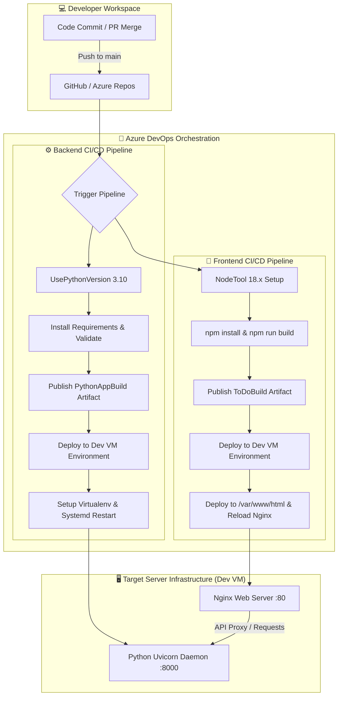

<p align="center">
  
</p>

<p align="center">
  
  
  
  
  
  
  
</p>

---

## 📌 Table of Contents

- [Overview](#-overview)
- [Architecture & Workflow](#-architecture--workflow)
- [Repository Structure](#-repository-structure)
- [Application Source Repositories](#-application-source-repositories)
- [CI/CD Pipelines Documentation](#-cicd-pipelines-documentation)
  - [Backend Pipeline (`dev-todoapp-pipeline.yml`)](#1-backend-pipeline-dev-todoapp-pipelineyml)
  - [Frontend Pipeline (`dev-todoui-pipeline.yml`)](#2-frontend-pipeline-dev-todoui-pipelineyml)
- [Docker Containerization](#-docker-containerization)
  - [Backend Dockerfile](#backend-dockerfile)
  - [Frontend Dockerfile](#frontend-frontend-dockerfile)
  - [Local Docker Execution Guide](#local-docker-execution-guide)
- [Azure DevOps Setup Guide](#-azure-devops-setup-guide)
- [Pipeline Variables & Secrets](#-pipeline-variables--secrets)
- [Frontend Interface](#-frontend-interface)
- [Troubleshooting & Best Practices](#-troubleshooting--best-practices)
- [Author & Credits](#-author--credits)

---

## 📌 Overview

This repository houses the complete **CI/CD (Continuous Integration & Continuous Deployment) Automation Pipeline** for a full-stack multi-service **Todo Application**. Built using **Azure DevOps**, **Docker**, **Python FastAPI**, and **ReactJS**, this project demonstrates industry standard practices for decoupled pipeline automation, artifact lifecycle management, containerization, and virtual machine deployment.

### 🌟 Key Technical Highlights
- **Decoupled Deployment Architecture:** Separates infrastructure and deployment automation code from application source code.
- **Automated CI/CD Workflows:** Automated triggers for commit integration, artifact building, stage dependencies, and zero-downtime release strategies.
- **Production-Grade Dockerization:** Includes multi-stage optimized builds, modern GPG keyring management, Microsoft SQL ODBC drivers, and container healthchecks.
- **Multi-Environment Deployment Target:** Pre-configured for deployment to Azure DevOps Virtual Machine Environment resources (`dev-env`).

---

## 🏗️ Architecture & Workflow

The pipeline orchestrates code flow from initial developer push down to production virtual machine servers and Nginx hosting layers.

### 📊 End-to-End Delivery Flow Diagram


```mermaid
flowchart TB
    subgraph Development ["💻 Developer Workspace"]
        A[Code Commit / PR Merge] -->|Push to main| B[GitHub / Azure Repos]
    end

    subgraph AzureDevOps ["🚀 Azure DevOps Orchestration"]
        B --> C{Trigger Pipeline}
        
        subgraph BackendCI ["⚙️ Backend CI/CD Pipeline"]
            C --> D1[UsePythonVersion 3.10]
            D1 --> D2[Install Requirements & Validate]
            D2 --> D3[Publish PythonAppBuild Artifact]
            D3 --> D4[Deploy to Dev VM Environment]
            D4 --> D5[Setup Virtualenv & Systemd Restart]
        end

        subgraph FrontendCI ["🎨 Frontend CI/CD Pipeline"]
            C --> E1[NodeTool 18.x Setup]
            E1 --> E2[npm install & npm run build]
            E2 --> E3[Publish ToDoBuild Artifact]
            E3 --> E4[Deploy to Dev VM Environment]
            E4 --> E5[Deploy to /var/www/html & Reload Nginx]
        end
    end

    subgraph Infrastructure ["🖥️ Target Server Infrastructure (Dev VM)"]
        D5 --> F1[Python Uvicorn Daemon :8000]
        E5 --> F2[Nginx Web Server :80]
        F2 -->|API Proxy / Requests| F1
    end
```

---

## 📁 Repository Structure

```text
CICD-Deployment-Automation-Pipeline/
├── ApplicationPipeline/
│   ├── dev-todoapp-pipeline.yml   # Azure DevOps YAML Pipeline for Python Backend CI/CD
│   └── dev-todoui-pipeline.yml    # Azure DevOps YAML Pipeline for React Frontend CI/CD
├── Docker/
│   ├── ToDoBackend/
│   │   └── Dockerfile             # Multi-layer Dockerfile (Python 3.10 + MS ODBC 17 + Healthcheck)
│   └── ToDoFrontend/
│       └── Dockerfile             # Multi-stage Dockerfile (Node 18 Builder -> Nginx Alpine Runtime)
├── Screenshot 2026-06-12 125801.png # Application UI Preview Screenshot
└── README.md                      # Pipeline & Project Documentation
```

---

## 📦 Application Source Repositories

The application source code is maintained across decoupled repositories:

| Component | Repository Link | Tech Stack | Runtime / Server |
| :--- | :--- | :--- | :--- |
| **Frontend UI** | [ReactTodoUIMonolith](https://github.com/devopsinsiders/ReactTodoUIMonolith) | ReactJS, JavaScript, HTML5, CSS3 | Nginx Web Server |
| **Backend API** | [PyTodoBackendMonolith](https://github.com/devopsinsiders/PyTodoBackendMonolith) | Python 3.10, FastAPI, REST API | Uvicorn / Systemd Daemon |

---

## 🔄 CI/CD Pipelines Documentation

### 1️⃣ Backend Pipeline ([`dev-todoapp-pipeline.yml`](file:///d:/CICD-Deployment-Automation-Pipeline/ApplicationPipeline/dev-todoapp-pipeline.yml))

Automates building, validating, and deploying the Python FastAPI backend service.

```yaml
trigger: 
  branches:
    include:
      - main

pool: default

stages:
  - stage: BuildAndPublish
    displayName: 'Build And Publish Backend'
    jobs:
      - job: BuildJob
        displayName: 'Build Backend Artifact'
        steps:
          - task: UsePythonVersion@0
            displayName: 'Set Python Version 3.9'
            inputs:
              versionSpec: '3.9'

          - task: PowerShell@2
            displayName: 'Upgrade Pip'
            inputs:
              targetType: 'inline'
              script: |
                python -m pip install --upgrade pip

          - task: PublishPipelineArtifact@1
            displayName: 'Publish Backend Artifact'
            inputs:
              targetPath: '$(Build.SourcesDirectory)/app'
              artifact: 'PythonAppBuild'
              publishLocation: 'pipeline'

  - stage: Deployment
    displayName: 'Deploy Backend Service'
    jobs:
      - deployment: Deployment
        displayName: 'Deploy Backend to Dev VM'
        environment: 
          name: dev-env
          resourceType: VirtualMachine
        strategy:
          runOnce:
            deploy: 
              steps:
                - task: DownloadPipelineArtifact@2
                  displayName: 'Download Backend Artifact'
                  inputs:
                    buildType: 'current'
                    artifactName: 'PythonAppBuild'
                    targetPath: '$(Pipeline.Workspace)/app'
```

---

### 2️⃣ Frontend Pipeline ([`dev-todoui-pipeline.yml`](file:///d:/CICD-Deployment-Automation-Pipeline/ApplicationPipeline/dev-todoui-pipeline.yml))

Automates building the React static bundle and publishing it to an Nginx web server.

```yaml
trigger: none

pool: default

stages:
  - stage: BuildAndPublish
    displayName: 'Build And Publish Frontend'
    jobs:
      - job: BuildJob
        displayName: 'Build Frontend Artifact'
        steps:
          - task: NodeTool@0
            displayName: 'Set Node.js 16.x'
            inputs:
              versionSource: 'spec'
              versionSpec: '16.x'

          - task: PowerShell@2
            displayName: 'Install Dependencies & Build App'
            inputs:
              targetType: 'inline'
              script: |
                npm install
                npm run build

          - task: PublishPipelineArtifact@1
            displayName: 'Publish Frontend Artifact'
            inputs:
              targetPath: '$(Build.SourcesDirectory)/build'
              artifact: 'ToDoBuild'
              publishLocation: 'pipeline'

  - stage: Deployment
    displayName: 'Deploy Frontend Service'
    jobs:
      - deployment: Deployment
        displayName: 'Deploy Frontend to Dev VM'
        environment: 
          name: dev-env
          resourceType: VirtualMachine
        strategy:
          runOnce:
            deploy: 
              steps:
                - task: DownloadBuildArtifacts@1
                  displayName: 'Download Frontend Artifacts'
                  inputs:
                    buildType: 'current'
                    downloadType: 'single'
                    artifactName: 'ToDoBuild'
                    downloadPath: '$(Pipeline.Workspace)'

                - task: Bash@3
                  displayName: 'Deploy Assets to Nginx Web Server'
                  inputs:
                    targetType: 'inline'
                    script: 'sudo cp -r $(Pipeline.Workspace)/* /var/www/html/'
```

---

## 🐳 Docker Containerization

Containerization manifests are located inside the `Docker/` directory for containerized deployment strategies.

### Backend Dockerfile ([`Docker/ToDoBackend/Dockerfile`](file:///d:/CICD-Deployment-Automation-Pipeline/Docker/ToDoBackend/Dockerfile))
- **Base Image:** `python:3.10-slim`
- **Key Enhancements:** Microsoft ODBC Driver 17 installation via modern GPG keyrings, clean APT package management, `HEALTHCHECK`, and `EXPOSE 8000`.

### Frontend Dockerfile ([`Docker/ToDoFrontend/Dockerfile`](file:///d:/CICD-Deployment-Automation-Pipeline/Docker/ToDoFrontend/Dockerfile))
- **Multi-stage Architecture:** `node:18-alpine` as builder stage and `nginx:alpine` as lightweight server runtime.
- **Port:** `80`.

### Local Docker Execution Guide

#### 1. Run Backend Container
```bash
# Build Backend Image
docker build -t todo-backend:latest ./Docker/ToDoBackend

# Run Backend Container
docker run -d -p 8000:8000 --name todo-backend-app todo-backend:latest
```

#### 2. Run Frontend Container
```bash
# Build Frontend Image
docker build -t todo-frontend:latest ./Docker/ToDoFrontend

# Run Frontend Container
docker run -d -p 80:80 --name todo-frontend-app todo-frontend:latest
```

---

## ⚡ Azure DevOps Setup Guide

To execute these pipelines in your Azure DevOps Organization, follow these setup steps:

1. **Create Environments:**
   - Navigate to **Azure DevOps Pipelines -> Environments**.
   - Create a new environment named `dev-env`.
   - Select **Virtual Machines** resource type and follow the registration script to register your target deployment server.

2. **Configure Agent Pools:**
   - Configure a self-hosted agent or assign your Microsoft-hosted agent to pool `default`.

3. **Import Pipelines:**
   - Go to **Pipelines -> New Pipeline**.
   - Select your Git Repository (`CICD-Deployment-Automation-Pipeline`).
   - Select **Existing Azure Pipelines YAML file**.
   - Choose `/ApplicationPipeline/dev-todoapp-pipeline.yml` for Backend CI/CD.
   - Repeat for `/ApplicationPipeline/dev-todoui-pipeline.yml` for Frontend CI/CD.

---

## 🔐 Pipeline Variables & Secrets

Configure the following pipeline variables under **Pipelines -> Library -> Variable Groups**:

| Variable Name | Description | Example / Recommended Value |
| :--- | :--- | :--- |
| `BACKEND_API_URL` | API server URL consumed by the Frontend UI | `http://<your-vm-ip>:8000` |
| `ENVIRONMENT` | Target Deployment Identifier | `dev` / `staging` / `prod` |
| `DEPLOYMENT_HOST` | Target VM IP address or domain | `10.0.0.4` |
| `SSH_PRIVATE_KEY` | Secret SSH Key for server authentication | `*** (Secured Variable)` |

---

## 🖥️ Frontend Interface

Below is a preview of the Todo Application user interface deployed via this CI/CD pipeline:

<p align="center">
  
</p>

---

## 🛠️ Troubleshooting & Best Practices

- **Nginx Permissions Issue:** Ensure Nginx process user has read rights to static files (`sudo chown -R www-data:www-data /var/www/html`).
- **Python Virtualenv Missing:** The pipeline script automatically creates `venv` inside `/var/www/todoapp/` if not present.
- **SQL ODBC Driver Key Errors:** Fixed in Dockerfile using `/usr/share/keyrings/microsoft-prod.gpg`.

---

## 👩‍💻 Author & Credits

**Priya Jaiswal**  
*Azure Cloud | DevOps Specialist | Terraform | CI/CD Engineering*

<p align="center">
  <a href="https://github.com/Pjaisw1103">
    
  </a>
  &nbsp;&nbsp;
  <a href="https://linkedin.com/in/priya-jaiswal1103">
    
  </a>
</p>

---

<p align="center">
  ⭐ If you found this repository helpful, consider starring it!
</p>
