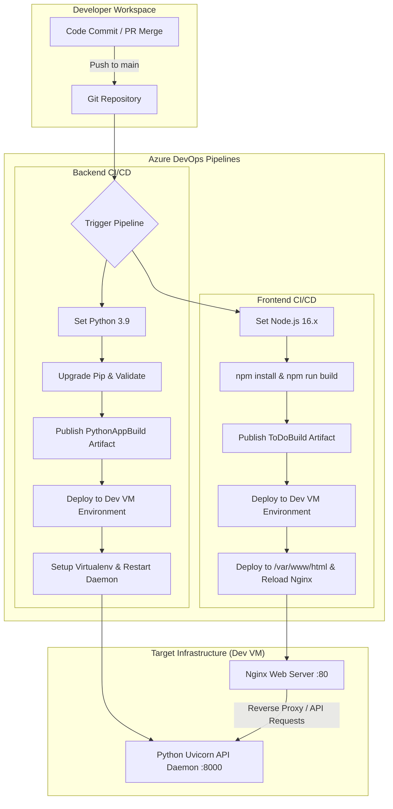

# CI/CD Deployment Automation Pipeline

[](https://azure.microsoft.com/en-us/products/devops)
[](#cicd-pipelines-documentation)
[](https://www.docker.com/)
[](https://www.python.org/)
[](https://react.dev/)
[](https://nginx.org/)
[](#)

An end-to-end Continuous Integration and Continuous Deployment (CI/CD) automation pipeline for a multi-service Todo web application. This repository demonstrates industry-standard practices for monorepo pipelines, Docker containerization, artifact publishing, and virtual machine deployment using Azure DevOps, Docker, Python FastAPI, and ReactJS.

---

## Table of Contents

- [Overview](#overview)
- [Architecture & Workflow](#architecture--workflow)
- [Repository Structure](#repository-structure)
- [Application Components](#application-components)
- [CI/CD Pipelines Documentation](#cicd-pipelines-documentation)
  - [Backend Pipeline (`dev-todoapp-pipeline.yml`)](#1-backend-pipeline-dev-todoapp-pipelineyml)
  - [Frontend Pipeline (`dev-todoui-pipeline.yml`)](#2-frontend-pipeline-dev-todoui-pipelineyml)
- [Docker Containerization](#docker-containerization)
  - [Backend Container](#1-backend-container)
  - [Frontend Container](#2-frontend-container)
- [Azure DevOps Setup Guide](#azure-devops-setup-guide)
- [Pipeline Variables & Secrets](#pipeline-variables--secrets)
- [Application Preview](#application-preview)
- [Troubleshooting & Best Practices](#troubleshooting--best-practices)
- [Author](#author)

---

## Overview

This repository provides an automated CI/CD workflow designed for deploying multi-service full-stack applications to Virtual Machine environments (`dev-env`) via Azure DevOps Pipelines and Docker.

### Key Highlights
- **Full-Stack Monorepo:** Houses both Python FastAPI backend and ReactJS frontend services in a single repository.
- **Automated CI/CD Workflows:** Automated triggers, artifact generation, stage dependencies, and zero-downtime release steps.
- **Production-Grade Dockerization:** Multi-stage builds, GPG keyring configuration for MS SQL ODBC drivers, and container healthchecks.
- **Target Infrastructure:** Pre-configured for automated deployments to Azure DevOps VM Environment resources (`dev-env`).

---

## Architecture & Workflow

The pipeline orchestrates code flow from developer commits through Azure DevOps CI/CD stages to the target deployment server running Nginx and Uvicorn.


```mermaid
flowchart TB
    subgraph Dev ["Developer Workspace"]
        A[Code Commit / PR Merge] -->|Push to main| B[Git Repository]
    end

    subgraph ADO ["Azure DevOps Pipelines"]
        B --> C{Trigger Pipeline}
        
        subgraph BackendCI ["Backend CI/CD"]
            C --> D1[Set Python 3.9]
            D1 --> D2[Upgrade Pip & Validate]
            D2 --> D3[Publish PythonAppBuild Artifact]
            D3 --> D4[Deploy to Dev VM Environment]
            D4 --> D5[Setup Virtualenv & Restart Daemon]
        end

        subgraph FrontendCI ["Frontend CI/CD"]
            C --> E1[Set Node.js 16.x]
            E1 --> E2[npm install & npm run build]
            E2 --> E3[Publish ToDoBuild Artifact]
            E3 --> E4[Deploy to Dev VM Environment]
            E4 --> E5[Deploy to /var/www/html & Reload Nginx]
        end
    end

    subgraph Infra ["Target Infrastructure (Dev VM)"]
        D5 --> F1[Python Uvicorn API Daemon :8000]
        E5 --> F2[Nginx Web Server :80]
        F2 -->|Reverse Proxy / API Requests| F1
    end
```

---

## Repository Structure

```text
CICD-Deployment-Automation-Pipeline/
├── ApplicationPipeline/
│   ├── dev-todoapp-pipeline.yml   # Azure DevOps YAML Pipeline for Backend CI/CD
│   └── dev-todoui-pipeline.yml    # Azure DevOps YAML Pipeline for Frontend CI/CD
├── Docker/
│   ├── ToDoBackend/
│   │   └── Dockerfile             # Backend Dockerfile (Python 3.10 + MS ODBC 17 + Healthcheck)
│   └── ToDoFrontend/
│       └── Dockerfile             # Frontend Multi-stage Dockerfile (Node 18 -> Nginx Alpine)
├── PyTodoBackendMonolith/         # Python FastAPI Backend Source Code
│   ├── app.py                     # REST API Server Logic
│   ├── requirements.txt           # Python Dependencies
│   ├── Dockerfile                 # Backend Standalone Dockerfile
│   └── azure-pipelines.yml        # Auto-Discovery Azure DevOps Pipeline
├── ReactTodoUIMonolith/           # ReactJS Frontend UI Source Code
│   ├── src/                       # React Components & UI Logic
│   ├── public/                    # Static Web Assets
│   ├── package.json               # Node.js Dependencies & Scripts
│   ├── Dockerfile                 # Frontend Standalone Dockerfile
│   └── azure-pipelines.yml        # Auto-Discovery Azure DevOps Pipeline
├── Screenshot 2026-06-12 125801.png # Application UI Preview Screenshot
└── README.md                      # Pipeline & Project Documentation
```

---

## Application Components

| Component | Directory | Tech Stack | Hosting / Runtime |
| :--- | :--- | :--- | :--- |
| **Backend API** | [`PyTodoBackendMonolith/`](./PyTodoBackendMonolith) | Python 3.10 / FastAPI | Uvicorn / Systemd Daemon |
| **Frontend UI** | [`ReactTodoUIMonolith/`](./ReactTodoUIMonolith) | React 18 / JavaScript | Nginx Web Server |

---

## CI/CD Pipelines Documentation

### 1. Backend Pipeline ([`dev-todoapp-pipeline.yml`](./ApplicationPipeline/dev-todoapp-pipeline.yml))

Automates building, artifact publishing, and deployment of the Python FastAPI service.

- **Trigger:** Automated trigger on commits to the `main` branch.
- **CI Stage:**
  - Provisions Python `3.9` environment.
  - Upgrades `pip` package manager.
  - Packages source files into pipeline artifact `PythonAppBuild`.
- **CD Stage:**
  - Targets Virtual Machine resources registered under environment `dev-env`.
  - Downloads `PythonAppBuild` to `$(Pipeline.Workspace)/app`.

### 2. Frontend Pipeline ([`dev-todoui-pipeline.yml`](./ApplicationPipeline/dev-todoui-pipeline.yml))

Automates building and deploying the React production bundle to Nginx web servers.

- **Trigger:** Configured for manual execution (`trigger: none`) or pipeline triggers.
- **CI Stage:**
  - Sets up Node.js `16.x` environment.
  - Executes `npm install` and `npm run build`.
  - Packages static build outputs into pipeline artifact `ToDoBuild`.
- **CD Stage:**
  - Targets VM resources in `dev-env`.
  - Copies published web assets to `/var/www/html/` on the deployment host.

---

## Docker Containerization

Standalone Dockerfiles are provided for isolated container builds.

### 1. Backend Container ([`Docker/ToDoBackend/Dockerfile`](./Docker/ToDoBackend/Dockerfile))
- **Base Image:** `python:3.10-slim`
- **Features:** Installs Microsoft ODBC Driver 17 via modern GPG keyring, includes `HEALTHCHECK`, exposes port `8000`.

```bash
# Build Backend Image
docker build -t todo-backend:latest -f Docker/ToDoBackend/Dockerfile ./PyTodoBackendMonolith

# Run Backend Container
docker run -d -p 8000:8000 --name todo-backend-app todo-backend:latest
```

### 2. Frontend Container ([`Docker/ToDoFrontend/Dockerfile`](./Docker/ToDoFrontend/Dockerfile))
- **Base Image:** Multi-stage build (`node:18-alpine` builder -> `nginx:alpine` runtime).
- **Features:** Lightweight static asset serving on port `80`.

```bash
# Build Frontend Image
docker build -t todo-frontend:latest -f Docker/ToDoFrontend/Dockerfile ./ReactTodoUIMonolith

# Run Frontend Container
docker run -d -p 80:80 --name todo-frontend-app todo-frontend:latest
```

---

## Azure DevOps Setup Guide

To configure and run these pipelines in Azure DevOps:

1. **Create Environment:**
   - Go to **Pipelines -> Environments** in Azure DevOps.
   - Create a new environment named `dev-env`.
   - Select **Virtual Machines** and execute the registration script on your target deployment server.

2. **Configure Agent Pool:**
   - Assign your self-hosted or Microsoft-hosted agent to pool `default`.

3. **Import Pipelines:**
   - Navigate to **Pipelines -> New Pipeline**.
   - Select your repository (`CICD-Deployment-Automation-Pipeline`).
   - Choose **Existing Azure Pipelines YAML file**.
   - Select `/ApplicationPipeline/dev-todoapp-pipeline.yml` for Backend CI/CD and `/ApplicationPipeline/dev-todoui-pipeline.yml` for Frontend CI/CD.

---

## Pipeline Variables & Secrets

Store configuration variables in Azure DevOps under **Pipelines -> Library -> Variable Groups**:

| Variable Name | Description | Example Value |
| :--- | :--- | :--- |
| `BACKEND_API_URL` | API server endpoint consumed by Frontend UI | `http://<server-ip>:8000` |
| `ENVIRONMENT` | Target Deployment Environment Identifier | `dev` / `staging` / `prod` |
| `DEPLOYMENT_HOST` | Target VM IP address or domain name | `10.x.x.x` |
| `SSH_PRIVATE_KEY` | Secret SSH Key for deployment access | `[Secured Variable]` |

---

## Application Preview


---

## Troubleshooting & Best Practices

- **Nginx File Permissions:** Ensure Nginx process user (`www-data`) has read permissions for target directory (`sudo chown -R www-data:www-data /var/www/html`).
- **Python Virtual Environment:** The deployment script checks and creates `/var/www/todoapp/venv` automatically if absent.
- **SQL ODBC GPG Key Warnings:** Handled directly in Dockerfile by referencing `/usr/share/keyrings/microsoft-prod.gpg`.

---

## Author

**Priya Jaiswal**  
*Azure Cloud & DevOps Engineer*

[](https://github.com/Pjaisw1103)
[](https://linkedin.com/in/priya-jaiswal1103)
